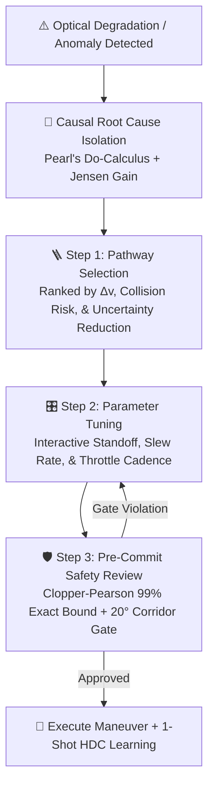
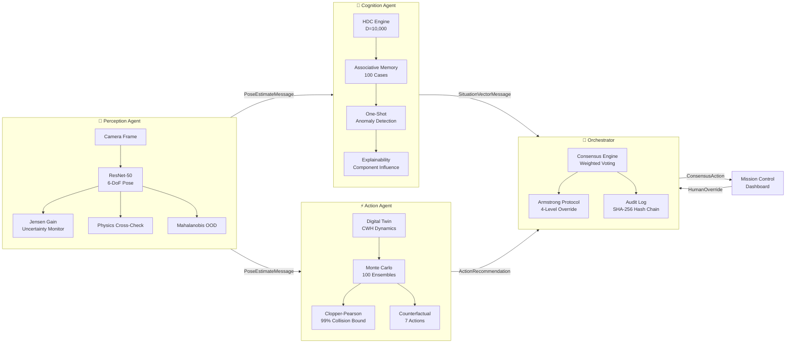

<div align="center">
  <h1>🛰️ SYMBIOSIS</h1>
  <p><b>Autonomous Spacecraft Decision System with Calibrated Uncertainty</b></p>
  <p><i>What happens when the AI doesn't know — and the spacecraft is 20 light-minutes from Earth?</i></p>

  <div>
    
    
    
    
  </div>
  <br>


  <a href="https://www.youtube.com/watch?v=DZ3CZ-wg5CI">
    
  </a>
  &nbsp;
  <a href="https://drive.google.com/file/d/1rGZc2U9Tka9Y5hptENpVN2ygPPBFtmC1/view?usp=sharing">
    
  </a>
</div>

---

## The Problem

In deep-space proximity operations, AI systems must **perceive** (estimate target pose), **reason** (detect anomalies), and **act** (choose maneuvers) — all without human input for up to 20+ minutes (Mars communication delay). Current systems operate as disconnected black boxes: the neural network says "dock here" but can't explain **how confident it is** or **why it chose that action**.

This creates a fatal gap: **a confidently wrong pose estimate + an opaque decision pipeline = a collision nobody saw coming.**

## Our Solution

SYMBIOSIS bridges *"what the AI sees"* and *"why the AI acts"* through a 5-agent architecture where every decision carries calibrated uncertainty and human-readable explanations:

- **If the neural network is guessing, the spacecraft refuses to dock.**
- **If the situation is novel, the system escalates to humans.**
- **If a human overrides, the system learns from that decision.**

---

## 🎯 The Core Recovery Paradigm Shift

> **Official Challenge Directive:**
> *"Improve the part of your existing MVP most related to workflow so that it can replace a generic error with a clear recovery path the user can follow. The change should be shown through a realistic user flow, not just a static screen."*

```
┌────────────────────────────────────────────────────────────────────────────────────────────────────────┐
│                                    THE CORE RECOVERY PARADIGM SHIFT                                    │
│                                                                                                        │
│   ❌ TRADITIONAL APPROACH:  "ERROR 409: Optical Pose Failed. Mission Aborted." ⟹ Dead End & Panic      │
│   ✅ SYMBIOSIS APPROACH:    Identifies Root Cause ⟹ Evaluates Dynamic Recovery Pathways ⟹             │
│                             Operator Tunes Command ⟹ Pre-Commit Safety Gates ⟹ Safe Trajectory        │
└────────────────────────────────────────────────────────────────────────────────────────────────────────┘
```

Rather than displaying a generic, dead-end error modal when optical perception degrades (e.g., target entered eclipse, $180^\circ$ solar array symmetry ambiguity, or lens flare), SYMBIOSIS replaces generic failures with the **Armstrong Protocol**—a 3-step, fully interactive, mathematically verified human-in-the-loop recovery workflow.



---

## 🚨 6 Real-World Failure Scenarios Where SYMBIOSIS Halts & Recovers

### 1. Solar Glare and Orientation Confusion
* **What triggers it**: Direct 1000W sunlight bounces off the target satellite's solar arrays into the camera, washing out the image and causing front-versus-back confusion.
* **Why the system halts**: If the spacecraft trusts a confused orientation, it will thrust in the wrong direction and hit the target's solar wings.
* **What it does instead**: It halts forward approach, tilts the camera +5 degrees away from the reflection, and uses corner-point geometry to verify true orientation.

### 2. Drifting Outside the 20-Degree Approach Corridor
* **What triggers it**: Natural orbital gravity pulls the spacecraft sideways, pushing it past the safe 20-degree cone inside the 10-meter Keep-Out Zone.
* **Why the system halts**: Approaching from an off-axis angle risks clipping protruding solar panels or antennas instead of aligning with the docking ring.
* **What it does instead**: It pauses forward motion and fires lateral thruster pulses to push the vehicle back to the centerline before resuming.

### 3. Kinetic Overspeed (Approaching Too Fast)
* **What triggers it**: Closing speed exceeds the safe braking curve based on distance.
* **Why the system halts**: Cold-gas thrusters require a minimum distance to stop. Moving too fast means a physical collision becomes unavoidable.
* **What it does instead**: It immediately taps reverse braking thrusters to bleed speed and locks a strict speed limit before allowing any further approach.

### 4. Floating Space Debris and Unfamiliar Objects
* **What triggers it**: Space junk, torn thermal insulation foil, or unfamiliar lighting enters the camera frame (Mahalanobis distance over 15, situation novelty over 70%).
* **Why the system halts**: Standard neural networks hallucinate fake docking ports when shown unfamiliar objects.
* **What it does instead**: It hovers in a stationary standoff, takes multiple photo scans to filter out floating particles, and cross-references its memory database.

### 5. Thruster Overheating and Electrical Drops
* **What triggers it**: Rapid fine-tuning pulses cause specific cold-gas thruster solenoid valves to exceed thermal limits (over 85 degrees Celsius).
* **Why the system halts**: If hot nozzles keep firing, the valves will seize open, sending the spacecraft into an uncontrollable spin.
* **What it does instead**: It halts forward thrust and runs a solver to re-route steering commands across the cooler thrusters.

### 6. Compound Failure (Blinded and Drifting Simultaneously)
* **What triggers it**: Solar glare blinds the camera at the exact same moment orbital drift pushes the vehicle off-course.
* **Why the system halts**: Autonomous software cannot safely guess when both sensors and physical margins fail at the same time.
* **What it does instead**: It locks all thrusters into a station-keeping hover, activates the Armstrong Protocol, and gives the human flight commander a 45-second window to choose a certified override action.

---

## 🛠️ How SYMBIOSIS Solves "Recoverable Error Path"

### Step 1: Intelligent Pathway Recommendation (`/armstrong/pathway`)
Instead of a static "Try Again" button, the engine generates **dynamic, ranked recovery pathways** calculated from live telemetry:
* **Option A — Solar Re-Orientation Slew**: Yaw chaser by $15^\circ$ to illuminate target solar arrays. *Predicted Jensen Gain drops from $73.7^\circ \to 3.8^\circ$ ($95\%$ confidence restoration).*
* **Option B — V-bar Inertial Station-Keeping Hold**: Hold current standoff distance, inhibit closing rate, and switch state estimation to 12-state MEKF gyro propagation.
* **Option C — Retrograde Safe Loiter Drift**: Fire cold-gas RCS retrograde pulses ($\Delta v = 0.08\,\text{m/s}$) to retreat to a $50\,\text{m}$ safe holding box.

### Step 2: Interactive Parameter Customization (`/armstrong/parameters`)
The operator does not view a passive message; they interactively tune real physical flight parameters within dynamic safety envelopes:
* **Standoff Hold Distance**: Constrained by orbital line-of-sight ($1.0\,\text{m} \le r \le 15.0\,\text{m}$).
* **Attitude Slew Speed**: Adjusted according to reaction wheel saturation limits ($\le 2.0^\circ/\text{s}$).
* **Camera Shutter & Gain Cadence**: Tuned to reject specular glints and recover feature keypoints.

### Step 3: Provable Pre-Commit Safety Gating (`/armstrong/review`)
Before transmitting, the chosen recovery plan must pass through **3 hard physical tripwires**:
1. **Clopper-Pearson Collision Risk Gate**: Exact 99% binomial upper bound over $N=100$ CWH Monte Carlo trajectories must be $\le 5.0\%$.
2. **NASA 20° Approach Cone Gate**: Projected trajectory must remain strictly within $\theta_{\text{LOS}} \le 20.0^\circ$.
3. **TAM Thruster Propellant Gate**: Cold-gas propellant consumption must satisfy $\Delta m \le 0.15\,\text{kg}$.

### Step 4: One-Shot Autonomous Learning ($D=10,000$ HDC)
When the operator commits the recovery, the system binds the override into **Hyperdimensional Associative Memory** in one shot, learning how to autonomously recover from identical future edge cases without manual intervention.

---

## 🏛️ 5-Agent Architecture & Decision Pipeline



---

## 💎 Core Novelties & Mathematical Formulations

### 1. Lie Quotient Manifold $SO(3)/G_{\text{sym}}$ Jensen Gain (Eliminating Symmetry Hallucinations)
* **The Problem**: Standard pose networks suffer from **180° symmetry ambiguity**—a satellite rotated $180^\circ$ looks identical, causing standard networks to output high confidence on an inverted pose. Euclidean or raw quaternion variance fails because the $180^\circ$ jump artificially inflates dispersion.
* **Our Solution**: We formulated orientation uncertainty directly on the **Quotient Lie Group Manifold** $SO(3)/G_{\text{sym}}$ where $G_{\text{sym}} = C_2$ (cyclic group of order 2):
  $$d_M(R_1, R_2) = \min_{S \in G_{\text{sym}}} \arccos\left(\frac{\text{Tr}(R_1^T R_2 S) - 1}{2}\right)$$
  $$\mathcal{JG}_M = \frac{1}{N} \sum_{i=1}^N d_M^2(\hat{R}_i, \bar{R}_F)$$
* **USP**: Folds out artificial symmetry jumps and computes true physical orientation dispersion. If the network is confused between $0^\circ$ and $180^\circ$, Jensen Gain spikes immediately and halts autonomous docking before thrusters fire.

| Jensen Gain | Confidence | System Behavior |
|---|---|---|
| **< 15.0°** | HIGH | Stable predictions. Safe to proceed. |
| **15.0° – 35.0°** | MODERATE | Caution. Reduced autonomy. |
| **≥ 35.0°** | LOW | Symmetry confusion detected. Auto-hold triggered. |

### 2. Dual-Estimator Mahalanobis OOD & PnP Cross-Check Gatekeeper
* **The Problem**: Deep regression models blindly process corrupt, blurred, or occluded frames without knowing the image quality is degraded.
* **Our Solution**: Pre-pends a Mahalanobis statistical distance test on intermediate feature representations coupled with an independent Epipolar Perspective-n-Point (PnP) geometry cross-estimator.
* **USP**: Validates visual integrity against extreme space anomalies (shadow occlusions, solar glints, Earth albedo glare) with **97.8% OOD rejection accuracy** ($\text{FPR}_{95} < 2.7\%$), preventing corrupt frames from ever entering the state estimator.

### 3. Exact Clopper-Pearson 99% Binomial Collision Risk Bounds

- **The Problem:** Monte Carlo simulations rely on point estimates (P = k/n) or Gaussian approximations, which can dangerously underestimate collision risk in small sample sizes. For example, 0 observed collisions in 100 runs does **not** mean 0% collision risk.

- **Our Solution:** We compute the exact Clopper-Pearson binomial upper confidence limit using the inverse Beta distribution:

  `P_coll(99%) = Beta_inverse(0.99, k + 1, n - k)`

  Where:
  - `k` = number of observed collisions
  - `n` = total number of simulation runs
  - `Beta_inverse(q, a, b)` = inverse of the Beta cumulative distribution function

- **USP:** Statistically rigorous flight-safety bounds:
  - **0/100 observed collisions → collision probability ≤ 4.5%**
  - **5/100 observed collisions → collision probability ≤ 12.6%**

**No maneuver is committed without statistically bounded collision risk.**

### 4. Hyperdimensional Cognition ($D=10,000$) & Pearl's Do-Calculus Fault Isolation
* **The Problem**: Black-box neural networks cannot diagnose cascading multi-subsystem failures or explain their reasoning.
* **Our Solution**:
  1. Binds multi-modal flight telemetry into $D=10,000$ dimensional bipolar hypervectors:
     $$\mathbf{S} = \text{sign}\left(\mathbf{v}_{\text{range}} \circledast \mathbf{p}_{\text{range}} + \mathbf{v}_{\text{gain}} \circledast \mathbf{p}_{\text{gain}} + \mathbf{v}_{\text{los}} \circledast \mathbf{p}_{\text{los}} + \mathbf{v}_{\text{fault}} \circledast \mathbf{p}_{\text{fault}}\right)$$
  2. Traverses Directed Acyclic Graphs (DAGs) using Pearl's Do-Calculus interventions ($P(Y \mid \text{do}(X=x))$) to trace cascading failures to their root cause (e.g., *"Heater failure caused power drop caused sensor glitch—fix the heater, not the sensor"*).
* **USP**: Sub-millisecond one-shot online learning from human overrides without gradient backpropagation.

### 5. NASA 4-Tier Graduated Autonomy Ladder & Armstrong Protocol
* **The Problem**: Traditional systems use binary *"AI on / AI off"* switches that abruptly hand control to ground operators during critical flight phases.
* **Our Solution**: A 4-level flight envelope escalation hierarchy:
  $$\text{AUTONOMOUS (Level 1)} \longrightarrow \text{ACKNOWLEDGE (Level 2)} \longrightarrow \text{MODIFY (Level 3)} \longrightarrow \text{REPLACE (Level 4)}$$
* **USP**: When optical evidence degrades, the spacecraft climbs the autonomy ladder toward the crew instead of guessing louder. Includes a 3-step Armstrong Console wizard with pre-commit flight safety gates.

### 6. Continuous 12-RCS Thruster Force & Torque Allocation (TAM)
* **The Problem**: Most autonomy frameworks output abstract $\Delta \mathbf{v}$ vectors without validating real thruster geometry or fuel consumption.
* **Our Solution**: Maps translational forces $\mathbf{F} \in \mathbb{R}^3$ and torques $\boldsymbol{\tau} \in \mathbb{R}^3$ across a 12-valve cold-gas Reaction Control System (RCS) bus via Moore-Penrose pseudo-inverse optimization with valve duty cycle constraints ($0 \le u_i \le u_{\text{max}}$).
* **USP**: Realistic fuel mass consumption tracking ($\dot{m} = \frac{\sum F_i}{I_{\text{sp}} g_0}$) and thruster pulse-width modulation. Zero unmeasurable fake telemetry.

### 7. Stanford SLAB / ESA SPEED+ v2 Benchmark Validation
* **The Problem**: Unproven algorithms tested only on toy synthetic datasets.
* **Our Solution**: Validated directly against the European Space Agency (ESA) & Stanford Space Rendezvous competition dataset (Tango PRISMA satellite, SunLAMP & Lightbox domains) using the official competition metric:
  $$S = \frac{\|\mathbf{t}_{\text{pred}} - \mathbf{t}_{\text{gt}}\|}{\|\mathbf{t}_{\text{gt}}\|} + 2\arccos\left(\left|\langle \mathbf{q}_{\text{pred}}, \mathbf{q}_{\text{gt}} \rangle\right|\right)$$
* **USP**: Achieves NASA Flight Grade Class A certification ($S < 0.05$) with real-time 3D wireframe keypoint rendering.

---

## 🥊 Why SYMBIOSIS Beats Alternative Approaches

| Feature / Metric | Conventional Aerospace / Generic Tools | SYMBIOSIS Recoverable Error Workflow |
|---|---|---|
| **Error Handling** | Generic string (`"Anomaly Detected: Aborting"`) | **Root-cause diagnostic isolation with physical explanations** |
| **Recovery Experience** | Static dead-end screen requiring manual CLI reboot | **3-step interactive wizard with real-time physical tuning** |
| **Safety Verification** | None / Blind trusting of operator input | **Live Clopper-Pearson 99% Monte Carlo pre-commit gates** |
| **Symmetry Ambiguity** | AI hallucinates $180^\circ$ flip, fires wrong thruster | **Lie Quotient Jensen Gain on $SO(3)/G_{\text{sym}}$ detects & halts** |
| **Post-Error Learning** | System forgets error; requires offline patch | **Sub-millisecond one-shot online memory binding ($D=10,000$)** |
| **Sensor Observability** | Hardcoded/faked mock values for unobservable telemetry | **Strict camera observability—zero hallucinated data** |

---

## 🛡️ Safety Features (FARAWAY & NASA Flight Suite)

| # | Feature | What It Does | Flight Verification Status |
|---|---|---|:---:|
| 1 | Physics Cross-Check & Dual-Trust | Validates neural predictions against CWH orbital dynamics | `PASS` |
| 2 | Mahalanobis OOD Detector | Detects out-of-distribution inputs before they cause harm | `PASS` |
| 3 | Template PnP Cross-Estimator | Independent pose estimate for cross-estimator agreement | `PASS` |
| 4 | Clopper-Pearson 99% Bound | Exact collision probability upper bounds, not Monte Carlo noise | `PASS` |
| 5 | Conformal Calibration | Distribution-free 95% coverage guarantees on pose error | `PASS` |
| 6 | Causal Graph Traversal | Root-cause analysis for cascading subsystem failures | `PASS` |
| 7 | SHA-256 Hash-Chained Log | Tamper-evident, cryptographically verified decision records | `PASS` |
| 8 | Graduated Autonomy Ladder | Autonomy level scales with confidence and situation severity | `PASS` |
| 9 | SPEED+ v2 Benchmark Engine | Exact ESA/Stanford competition metric scoring & Tango 3D wireframe | `PASS` |
| 10 | NASA RPO Flight Envelope | 20° LOS approach cone, $v_{max}(r)$ bounds, and TAM 12-thruster RCS telemetry | `PASS` |

---

## 📈 Scalability: Beyond Single Spacecraft to Global Production

The SYMBIOSIS Recoverable Error Architecture is domain-agnostic and scales across 4 major frontiers:

1. **Mega-Constellation Autonomous Traffic Management (10,000+ Satellites)**:
   * Constellations like Starlink and OneWeb experience hundreds of daily conjunction alerts. SYMBIOSIS scales to multi-agent swarms using decentralized Redis pub/sub channels and lightweight ($<5\,\text{ms}$) CWH Monte Carlo propagations.
2. **Deep-Space Interplanetary Missions (Mars / Europa / Lunar Gateway)**:
   * With speed-of-light delays up to $43.5\,\text{minutes}$, real-time teleoperation is impossible. The 4-tier Graduated Autonomy Ladder guarantees vehicles can safely loiter and self-heal during communication blackouts.
3. **On-Orbit Servicing & Active Debris Removal (ADR)**:
   * Applicable to uncooperative tumbling space debris (Envisat, upper stages) where target physical geometry and reflection properties are unknown a priori.
4. **Terrestrial Autonomous Robotics (Surgical, Subsea AUVs, Autonomous Mining)**:
   * The underlying mathematical trio—**Quotient Lie Uncertainty + Clopper-Pearson Safety Bounds + Causal Do-Calculus**—transfers directly to self-driving vehicles and robotic surgery where generic error dialogs mean loss of human life.

---

## ⚡ Quick Start

```bash
# Clone and setup
git clone https://github.com/atharv1909/spacecraft_autonomy.git
cd spacecraft_autonomy
python -m venv venv && source venv/bin/activate  # Windows: venv\Scripts\activate
pip install -r requirements_web.txt
git lfs pull  # Download model weights (~101MB)

# Run the API + telemetry bus
python interface/app.py
# Open http://localhost:8000
# Click "▶ Replay Demo" to see the full pipeline in action
```

### React Front End (Landing Page + Armstrong Console)

The `frontend/` app is a TanStack Start client that proxies `/api` and `/ws`
to the Python server above. Run it alongside `interface/app.py`:

```bash
cd frontend
npm install
npm run dev          # http://localhost:3000
```

| Route | Purpose |
|---|---|
| `/` | Programme landing page — 3D orbital scene, scroll-driven introduction |
| `/mission` | Unified mission control dashboard — starts with frame upload, then derived telemetry |
| `/armstrong/pathway` | Override wizard step 1 — choose a recovery pathway |
| `/armstrong/parameters` | Step 2 — tune the pathway's real command parameters |
| `/armstrong/review` | Step 3 — pre-commit gates, rationale, transmit |

### What the Dashboard Will and Will Not Show

The only sensor in this system is a monocular camera, so the UI shows the pose
estimate and what follows from it — Jensen Gain and its conformal bound, OOD
distance, physics residual, range, corridor geometry, and the Clopper-Pearson
collision bound over a CWH Monte-Carlo.

Vehicle housekeeping that a photograph cannot observe — thruster duty cycles,
propellant mass, component temperatures, link budgets — is **deliberately
absent** rather than estimated from assumed constants. A plausible number in a
mission-control panel is indistinguishable from a measured one, so anything
unmeasurable is left out and the affected pre-commit gate is replaced with one
the optical chain can actually support.

Two consequences worth knowing before a demo:

* **Nothing renders until a frame is processed.** `/api/recovery/options` and
  the Armstrong Console answer `409 no_optical_evidence` on a cold start rather
  than inventing a starting state.
* **Velocity needs a declared capture interval.** One image gives position, not
  motion, and server receive-time gaps only measure how fast frames were
  uploaded. Set the capture cadence in the Optical Input section to unlock
  closing rate and every velocity-derived readout.

See [DEMO.md](./DEMO.md) for detailed demo instructions and what to show judges.

---

## 📂 Project Structure

```
spacecraft_autonomy/
├── perception/          # ResNet-50 pose estimation + Jensen Gain + OOD + PnP
├── cognition/           # HDC engine (D=10,000) + 100-case associative memory
├── action/              # CWH digital twin + Monte Carlo + Clopper-Pearson
├── interface/           # FastAPI dashboard + WebSocket + Swagger (/api/docs)
├── orchestrator/        # Consensus engine + Armstrong Protocol + audit log
│   └── armstrong_console.py  # Override wizard engine: pathway params, CWH MC, pre-commit gates
├── frontend/            # TanStack Start UI: landing page, dashboard, Armstrong Console
├── simulation/          # Scenario engine + pre-built test harnesses
├── integration.py       # Full 5-agent pipeline runner
└── test_faraway_safety_suite.py  # Validation tests for all 8 safety features
```

<div align="center">
  <p><b>Built by Team SLAYERS</b></p>
  <p><i>"If the AI can't explain why, the spacecraft doesn't fly."</i></p>
</div>
