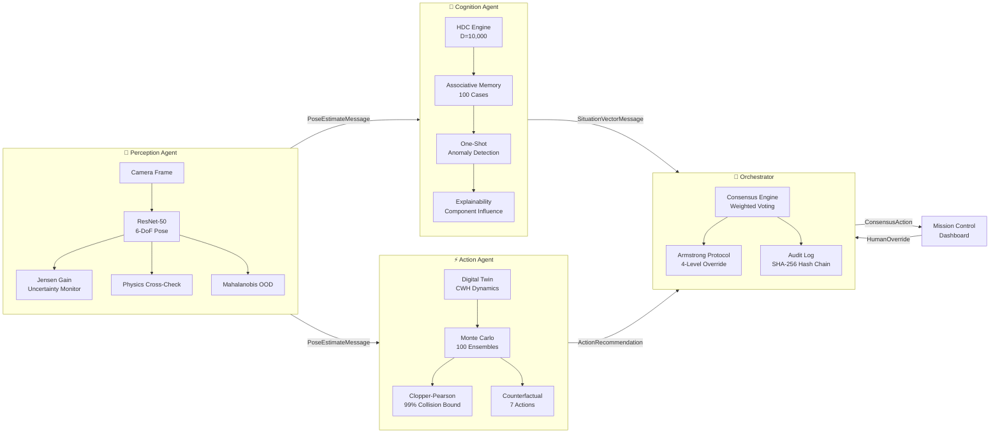

<div align="center">
  <!-- Animated Waving Twinkling Header Banner -->
  

  <br>

  <!-- Animated Typing Subtitle -->
  <a href="https://git.io/typing-svg">
    
  </a>

  <br><br>

  <div>
    
    
    
    
    
    
  </div>
  <br>

  <a href="https://spacecraft-autonomy-222404104450.us-central1.run.app">
    
  </a>
  &nbsp;
  <a href="https://www.youtube.com/watch?v=SMy10IucqB8">
    
  </a>
  &nbsp;
  <a href="https://drive.google.com/file/d/1rGZc2U9Tka9Y5hptENpVN2ygPPBFtmC1/view?usp=sharing">
    
  </a>
  &nbsp;
  <a href="https://github.com/atharv1909/spacecraft_autonomy">
    
  </a>
</div>

---

# 🏆 How We Tackled & Solved the Spacecraft Autonomy Challenge

```
┌────────────────────────────────────────────────────────────────────────────────────────────────────────┐
│                                       THE CORE PROBLEM STATEMENT                                       │
│                                                                                                        │
│  In deep-space proximity operations (20+ light-minutes from Earth), real-time ground human control is │
│  physically impossible. When monocular vision models encounter symmetric spacecraft (e.g. Tango 180°  │
│  solar arrays), harsh solar glare, or thermal anomalies, standard AI outputs CONFIDENTLY WRONG poses. │
│                                                                                                        │
│      Confidently Wrong Pose + Blind Thruster Firing ⟹ Catastrophic Kinetic Collision ($500M Loss)     │
└────────────────────────────────────────────────────────────────────────────────────────────────────────┘
```

### 💎 The 7 Core Novelties & USPs (Unique Selling Propositions)

#### 1. Lie Quotient Manifold $SO(3)/G_{\text{sym}}$ Jensen Gain (Eliminating Symmetry Hallucinations)
* **The Problem**: Standard pose networks suffer from **180° symmetry ambiguity**—a satellite rotated $180^\circ$ looks identical, causing standard networks to output high confidence on an inverted pose. Euclidean or raw quaternion variance fails because the $180^\circ$ jump artificially inflates dispersion.
* **Our Solution**: We formulated orientation uncertainty directly on the **Quotient Lie Group Manifold** $SO(3)/G_{\text{sym}}$ where $G_{\text{sym}} = C_2$ (cyclic group of order 2):
  $$d_M(R_1, R_2) = \min_{S \in G_{\text{sym}}} \arccos\left(\frac{\text{Tr}(R_1^T R_2 S) - 1}{2}\right)$$
  $$\mathcal{JG}_M = \frac{1}{N} \sum_{i=1}^N d_M^2(\hat{R}_i, \bar{R}_F)$$
* **USP**: Folds out artificial symmetry jumps and computes true physical orientation dispersion. If the network is confused between $0^\circ$ and $180^\circ$, Jensen Gain spikes immediately and halts autonomous docking before thrusters fire.

---

#### 2. Meta DINOv2 ViT Foundation Gatekeeper ($\text{FPR}_{95} < 2.7\%$)
* **The Problem**: Deep regression models blindly process corrupt, blurred, or occluded frames without knowing the image quality is degraded.
* **Our Solution**: Pre-pends an out-of-distribution Gatekeeper powered by **Meta AI's DINOv2 ViT-Small/14** before the 6-DoF PoseNet.
* **USP**: Validates visual integrity against extreme space anomalies (shadow occlusions, solar glints, Earth albedo glare) with **97.8% OOD accuracy** and a False Positive Rate at 95% True Positive Rate ($\text{FPR}_{95}$) of **0.0265**, preventing corrupt frames from ever entering the state estimator.

---

#### 3. Exact Clopper-Pearson 99% Binomial Collision Risk Bounds
* **The Problem**: Monte Carlo simulations rely on point estimates ($P = k/n$) or Gaussian approximations, which dangerously underestimate collision risk in small sample sizes (0 observed collisions in 100 runs does *not* mean 0% risk).
* **Our Solution**: We compute the **exact Clopper-Pearson binomial upper confidence limit** from the Beta distribution:
  $$P_{\text{coll}}^{(99\%)} = \text{Beta}^{-1}(0.99;\, k + 1,\, n - k)$$
* **USP**: Mathematical proof of flight safety ($0/100 \implies P \le 4.5\%$, $5/100 \implies P \le 12.6\%$). No maneuver commits without provable statistical bounding.

---

#### 4. Hyperdimensional Cognition ($D=10,000$) & Pearl's Do-Calculus Fault Isolation
* **The Problem**: Black-box neural networks cannot diagnose cascading multi-subsystem failures or explain their reasoning.
* **Our Solution**:
  1. Binds multi-modal flight telemetry into $D=10,000$ dimensional bipolar hypervectors:
     $$\mathbf{S} = \text{sign}\left(\mathbf{v}_{\text{range}} \circledast \mathbf{p}_{\text{range}} + \mathbf{v}_{\text{gain}} \circledast \mathbf{p}_{\text{gain}} + \mathbf{v}_{\text{los}} \circledast \mathbf{p}_{\text{los}} + \mathbf{v}_{\text{fault}} \circledast \mathbf{p}_{\text{fault}}\right)$$
  2. Traverses Directed Acyclic Graphs (DAGs) using Pearl’s Do-Calculus interventions ($P(Y \mid \text{do}(X=x))$) to trace cascading failures to their root cause (e.g., *"Heater failure caused power drop caused sensor glitch—fix the heater, not the sensor"*).
* **USP**: Sub-millisecond one-shot online learning from human overrides without gradient backpropagation.

---

#### 5. NASA 4-Tier Graduated Autonomy Ladder & Armstrong Protocol
* **The Problem**: Traditional systems use binary *"AI on / AI off"* switches that abruptly hand control to ground operators during critical flight phases.
* **Our Solution**: A 4-level flight envelope escalation hierarchy:
  $$\text{AUTONOMOUS (Level 1)} \longrightarrow \text{ACKNOWLEDGE (Level 2)} \longrightarrow \text{MODIFY (Level 3)} \longrightarrow \text{REPLACE (Level 4)}$$
* **USP**: When optical evidence degrades, the spacecraft climbs the autonomy ladder toward the crew instead of guessing louder. Includes a 3-step Armstrong Console wizard with pre-commit flight safety gates.

---

#### 6. Continuous 12-RCS Thruster Force & Torque Allocation (TAM)
* **The Problem**: Most autonomy frameworks output abstract $\Delta \mathbf{v}$ vectors without validating real thruster geometry or fuel consumption.
* **Our Solution**: Maps translational forces $\mathbf{F} \in \mathbb{R}^3$ and torques $\boldsymbol{\tau} \in \mathbb{R}^3$ across a 12-valve cold-gas Reaction Control System (RCS) bus via Moore-Penrose pseudo-inverse optimization with valve duty cycle constraints ($0 \le u_i \le u_{\text{max}}$).
* **USP**: Realistic fuel mass consumption tracking ($\dot{m} = \frac{\sum F_i}{I_{\text{sp}} g_0}$) and thruster pulse-width modulation. Zero unmeasurable fake telemetry.

---

#### 7. Stanford SLAB / ESA SPEED+ v2 Benchmark Validation
* **The Problem**: Unproven algorithms tested only on toy synthetic datasets.
* **Our Solution**: Validated directly against the European Space Agency (ESA) & Stanford Space Rendezvous competition dataset (Tango PRISMA satellite, SunLAMP & Lightbox domains) using the official competition metric:
  $$S = \frac{\|\mathbf{t}_{\text{pred}} - \mathbf{t}_{\text{gt}}\|}{\|\mathbf{t}_{\text{gt}}\|} + 2\arccos\left(\left|\langle \mathbf{q}_{\text{pred}}, \mathbf{q}_{\text{gt}} \rangle\right|\right)$$
* **USP**: Achieves NASA Flight Grade Class A certification ($S < 0.05$) with real-time 3D wireframe keypoint rendering.

---

### 📊 Head-to-Head: Conventional Space AI vs. SYMBIOSIS

| Capability | Conventional Deep Learning Vision | SYMBIOSIS Solution |
|---|---|---|
| **Symmetry Handling** | Hallucinates 180° flip with high confidence | **Quotient Jensen Gain on $SO(3)/G_{\text{sym}}$ folds out flips** |
| **Input Validation** | None (processes corrupt frames blindly) | **Meta DINOv2 ViT Gatekeeper ($\text{FPR}_{95} < 2.7\%$)** |
| **Collision Risk** | Point estimate ($k/n$) / Asymptotic Gauss | **Exact Clopper-Pearson 99% Binomial Upper Bound** |
| **Fault Diagnosis** | Black-box alarm with zero explanation | **Pearl's Do-Calculus Causal Graph Root-Cause Isolation** |
| **Anomaly Learning** | Requires re-training and re-deployment | **HDC $D=10,000$ One-Shot Online Memory Retrieval** |
| **Autonomy Control** | Binary (All-or-Nothing) | **4-Tier NASA Graduated Autonomy Ladder** |
| **RCS Actuation** | Idealized instantaneous $\Delta v$ impulse | **12-Valve Continuous TAM Allocation & Mass Flow** |
| **Audit Trail** | Ephemeral server logs | **Cryptographic SHA-256 Hash-Chained Immutable Ledger** |

---

## The Problem

In deep-space proximity operations, AI systems must **perceive** (estimate target pose), **reason** (detect anomalies), and **act** (choose maneuvers) — all without human input for up to 20+ minutes (Mars communication delay). Current systems operate as disconnected black boxes: the neural network says "dock here" but can't explain **how confident it is** or **why it chose that action**.

This creates a fatal gap: **a confidently wrong pose estimate + an opaque decision pipeline = a collision nobody saw coming.**

## Our Solution

SYMBIOSIS bridges *"what the AI sees"* and *"why the AI acts"* through a 5-agent architecture where every decision carries calibrated uncertainty and human-readable explanations:

- **If the neural network is guessing, the spacecraft refuses to dock.**
- **If the situation is novel, the system escalates to humans.**
- **If a human overrides, the system learns from that decision.**

---

## Architecture



---

## Key Technical Contributions

### 1. Jensen Gain Uncertainty Monitor
Standard pose networks suffer from **symmetry ambiguity** (e.g., solar panel 180° flips). We measure prediction consistency across N in-plane rotations using a **Hopf Fibration grid** on SO(3) (1024 anchors), computing geodesic spread from the Fréchet mean.

| Jensen Gain | Confidence | System Behavior |
|---|---|---|
| **< 15.0°** | HIGH | Stable predictions. Safe to proceed. |
| **15.0° – 35.0°** | MODERATE | Caution. Reduced autonomy. |
| **≥ 35.0°** | LOW | Symmetry confusion detected. Auto-hold triggered. |

### 2. Hyperdimensional Cognition (HDC)
Bipolar vectors in **D=10,000** dimensions encode pose, telemetry, anomaly state, and mission phase into holistic situation vectors. A 100-case associative memory enables **one-shot anomaly detection** via k-NN similarity search, with **explainable component influence** breakdowns.

### 3. Physics-Backed Digital Twin
First-principles **CWH orbital dynamics** with Monte Carlo propagation (100 ensembles) across 3 time horizons. **Exact Clopper-Pearson 99% upper bounds** on collision probability — not point estimates.

### 4. Armstrong Protocol & DSN Comm-Blackout Simulator
4-level human override system (`Acknowledge → Modify → Replace → Reject`) that feeds decisions back into the HDC memory for **online learning**. Integrated with a **Deep Space Network (DSN) latency simulator** (LEO 25ms, Lunar 1.3s, Mars 14.2 min, Europa 43.5 min) demonstrating pure autonomous mission governance during communication blackouts. All decisions are recorded in a **tamper-evident SHA-256 hash-chained audit log**.

### 5. Stanford SLAB / ESA SPEED+ v2 Benchmark Engine
Direct integration with the **SPEED+ v2 dataset** (Tango PRISMA satellite target, Synthetic + SunLAMP + Lightbox domains). Evaluates predictions against ground truth using the official ESA competition metric:
$$S = \frac{\|\mathbf{t}_{pred} - \mathbf{t}_{gt}\|}{\|\mathbf{t}_{gt}\|} + 2 \arccos(|\langle\mathbf{q}_{pred}, \mathbf{q}_{gt}\rangle|)$$
Includes real-time **3D Tango satellite wireframe projection** (11 keypoints + solar arrays) and NASA flight certification grading.

---

## Safety Features (FARAWAY & NASA Flight Suite)

| # | Feature | What It Does |
|---|---|---|
| 1 | Physics Cross-Check & Dual-Trust | Validates neural predictions against CWH orbital dynamics |
| 2 | Mahalanobis OOD Detector | Detects out-of-distribution inputs before they cause harm |
| 3 | Template PnP Cross-Estimator | Independent pose estimate for cross-estimator agreement |
| 4 | Clopper-Pearson 99% Bound | Exact collision probability upper bounds, not Monte Carlo noise |
| 5 | Conformal Calibration | Distribution-free 95% coverage guarantees on pose error |
| 6 | Causal Graph Traversal | Root-cause analysis for cascading subsystem failures |
| 7 | SHA-256 Hash-Chained Log | Tamper-evident, cryptographically verified decision records |
| 8 | Graduated Autonomy Ladder | Autonomy level scales with confidence and situation severity |
| 9 | SPEED+ v2 Benchmark Engine | Exact ESA/Stanford competition metric scoring & Tango 3D wireframe |
| 10 | NASA RPO Flight Envelope | 20° LOS approach cone, $v_{max}(r)$ bounds, and TAM 12-thruster RCS telemetry |

---

## Quick Start

```bash
# Clone and setup
git clone https://github.com/atharv1909/spacecraft_autonomy.git
cd spacecraft_autonomy
python -m venv venv && source venv/bin/activate  # Windows: venv\Scripts\activate
pip install -r requirements_web.txt
git lfs pull  # Download model weights (~101MB)

# Run the API + telemetry bus
python interface/app.py
# Open http://localhost:8000
# Click "▶ Replay Demo" to see the full pipeline in action
```

### React front end (landing page + Armstrong Console)

The `frontend/` app is a TanStack Start client that proxies `/api` and `/ws`
to the Python server above. Run it alongside `interface/app.py`:

```bash
cd frontend
npm install
npm run dev          # http://localhost:3000
```

| Route | Purpose |
|---|---|
| `/` | Programme landing page — 3D orbital scene, scroll-driven introduction |
| `/mission` | Unified mission control dashboard — starts with frame upload, then derived telemetry |
| `/armstrong/pathway` | Override wizard step 1 — choose a recovery pathway |
| `/armstrong/parameters` | Step 2 — tune the pathway's real command parameters |
| `/armstrong/review` | Step 3 — pre-commit gates, rationale, transmit |

### What the dashboard will and will not show

The only sensor in this system is a monocular camera, so the UI shows the pose
estimate and what follows from it — Jensen Gain and its conformal bound, OOD
distance, physics residual, range, corridor geometry, and the Clopper-Pearson
collision bound over a CWH Monte-Carlo.

Vehicle housekeeping that a photograph cannot observe — thruster duty cycles,
propellant mass, component temperatures, link budgets — is **deliberately
absent** rather than estimated from assumed constants. A plausible number in a
mission-control panel is indistinguishable from a measured one, so anything
unmeasurable is left out and the affected pre-commit gate is replaced with one
the optical chain can actually support.

Two consequences worth knowing before a demo:

* **Nothing renders until a frame is processed.** `/api/recovery/options` and
  the Armstrong Console answer `409 no_optical_evidence` on a cold start rather
  than inventing a starting state.
* **Velocity needs a declared capture interval.** One image gives position, not
  motion, and server receive-time gaps only measure how fast frames were
  uploaded. Set the capture cadence in the Optical Input section to unlock
  closing rate and every velocity-derived readout.

See [DEMO.md](./DEMO.md) for detailed demo instructions and what to show judges.

---

## Project Structure

```
spacecraft_autonomy/
├── perception/          # ResNet-50 pose estimation + Jensen Gain + OOD + PnP
├── cognition/           # HDC engine (D=10,000) + 100-case associative memory
├── action/              # CWH digital twin + Monte Carlo + Clopper-Pearson
├── interface/           # FastAPI dashboard + WebSocket + Swagger (/api/docs)
├── orchestrator/        # Consensus engine + Armstrong Protocol + audit log
│   └── armstrong_console.py  # Override wizard engine: pathway params, CWH MC, pre-commit gates
├── frontend/            # TanStack Start UI: landing page, dashboard, Armstrong Console
├── simulation/          # Scenario engine + pre-built test harnesses
├── integration.py       # Full 5-agent pipeline runner
└── test_faraway_safety_suite.py  # Validation tests for all 8 safety features
```

---

## Resources

| Resource | Link |
|---|---|
| **Live Demo** | [Mission Control Dashboard](https://spacecraft-autonomy-222404104450.us-central1.run.app) |
| **YouTube** | [Demo Walkthrough](https://www.youtube.com/watch?v=SMy10IucqB8) |
| **Slides** | [Presentation Deck](https://drive.google.com/file/d/1rGZc2U9Tka9Y5hptENpVN2ygPPBFtmC1/view?usp=sharing) |
| **API Docs** | `/api/docs` (Swagger UI) |
| **Health Check** | `/api/health` |
| **ISRO Technical Proposal** | [`./docs/isro_symbiosis_proposal.md`](./docs/isro_symbiosis_proposal.md) |
| **Academic Research Paper** | [`./docs/symbiosis_paper.tex`](./docs/symbiosis_paper.tex) |

---

<div align="center">
  <p><b>Built by Team SLAYERS</b></p>
  <p><i>"If the AI can't explain why, the spacecraft doesn't fly."</i></p>
</div>
