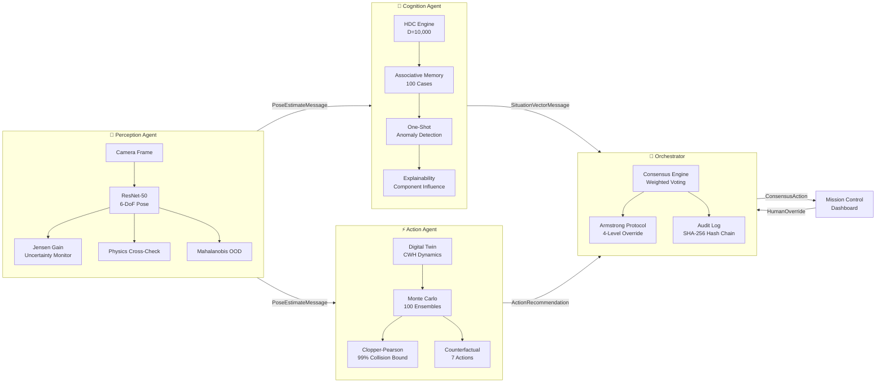

<div align="center">
  <h1>🛰️ SYMBIOSIS</h1>
  <p><b>Autonomous Spacecraft Decision System with Calibrated Uncertainty</b></p>
  <p><i>What happens when the AI doesn't know — and the spacecraft is 20 light-minutes from Earth?</i></p>

  <div>
    
    
    
    
  </div>
  <br>

  <a href="https://spacecraft-autonomy-222404104450.us-central1.run.app">
    
  </a>
  &nbsp;
  <a href="https://www.youtube.com/watch?v=SMy10IucqB8">
    
  </a>
  &nbsp;
  <a href="https://drive.google.com/file/d/1rGZc2U9Tka9Y5hptENpVN2ygPPBFtmC1/view?usp=sharing">
    
  </a>
</div>

---

## The Problem

In deep-space proximity operations, AI systems must **perceive** (estimate target pose), **reason** (detect anomalies), and **act** (choose maneuvers) — all without human input for up to 20+ minutes (Mars communication delay). Current systems operate as disconnected black boxes: the neural network says "dock here" but can't explain **how confident it is** or **why it chose that action**.

This creates a fatal gap: **a confidently wrong pose estimate + an opaque decision pipeline = a collision nobody saw coming.**

## Our Solution

SYMBIOSIS bridges *"what the AI sees"* and *"why the AI acts"* through a 5-agent architecture where every decision carries calibrated uncertainty and human-readable explanations:

- **If the neural network is guessing, the spacecraft refuses to dock.**
- **If the situation is novel, the system escalates to humans.**
- **If a human overrides, the system learns from that decision.**

---

## Architecture



---

## Key Technical Contributions

### 1. Jensen Gain Uncertainty Monitor
Standard pose networks suffer from **symmetry ambiguity** (e.g., solar panel 180° flips). We measure prediction consistency across N in-plane rotations using a **Hopf Fibration grid** on SO(3) (1024 anchors), computing geodesic spread from the Fréchet mean.

| Jensen Gain | Confidence | System Behavior |
|---|---|---|
| **< 15.0°** | HIGH | Stable predictions. Safe to proceed. |
| **15.0° – 35.0°** | MODERATE | Caution. Reduced autonomy. |
| **≥ 35.0°** | LOW | Symmetry confusion detected. Auto-hold triggered. |

### 2. Hyperdimensional Cognition (HDC)
Bipolar vectors in **D=10,000** dimensions encode pose, telemetry, anomaly state, and mission phase into holistic situation vectors. A 100-case associative memory enables **one-shot anomaly detection** via k-NN similarity search, with **explainable component influence** breakdowns.

### 3. Physics-Backed Digital Twin
First-principles **CWH orbital dynamics** with Monte Carlo propagation (100 ensembles) across 3 time horizons. **Exact Clopper-Pearson 99% upper bounds** on collision probability — not point estimates.

### 4. Armstrong Protocol & DSN Comm-Blackout Simulator
4-level human override system (`Acknowledge → Modify → Replace → Reject`) that feeds decisions back into the HDC memory for **online learning**. Integrated with a **Deep Space Network (DSN) latency simulator** (LEO 25ms, Lunar 1.3s, Mars 14.2 min, Europa 43.5 min) demonstrating pure autonomous mission governance during communication blackouts. All decisions are recorded in a **tamper-evident SHA-256 hash-chained audit log**.

### 5. Stanford SLAB / ESA SPEED+ v2 Benchmark Engine
Direct integration with the **SPEED+ v2 dataset** (Tango PRISMA satellite target, Synthetic + SunLAMP + Lightbox domains). Evaluates predictions against ground truth using the official ESA competition metric:
$$S = \frac{\|\mathbf{t}_{pred} - \mathbf{t}_{gt}\|}{\|\mathbf{t}_{gt}\|} + 2 \arccos(|\langle\mathbf{q}_{pred}, \mathbf{q}_{gt}\rangle|)$$
Includes real-time **3D Tango satellite wireframe projection** (11 keypoints + solar arrays) and NASA flight certification grading.

---

## Safety Features (FARAWAY & NASA Flight Suite)

| # | Feature | What It Does |
|---|---|---|
| 1 | Physics Cross-Check & Dual-Trust | Validates neural predictions against CWH orbital dynamics |
| 2 | Mahalanobis OOD Detector | Detects out-of-distribution inputs before they cause harm |
| 3 | Template PnP Cross-Estimator | Independent pose estimate for cross-estimator agreement |
| 4 | Clopper-Pearson 99% Bound | Exact collision probability upper bounds, not Monte Carlo noise |
| 5 | Conformal Calibration | Distribution-free 95% coverage guarantees on pose error |
| 6 | Causal Graph Traversal | Root-cause analysis for cascading subsystem failures |
| 7 | SHA-256 Hash-Chained Log | Tamper-evident, cryptographically verified decision records |
| 8 | Graduated Autonomy Ladder | Autonomy level scales with confidence and situation severity |
| 9 | SPEED+ v2 Benchmark Engine | Exact ESA/Stanford competition metric scoring & Tango 3D wireframe |
| 10 | NASA RPO Flight Envelope | 20° LOS approach cone, $v_{max}(r)$ bounds, and TAM 12-thruster RCS telemetry |

---

## Quick Start

```bash
# Clone and setup
git clone https://github.com/atharv1909/spacecraft_autonomy.git
cd spacecraft_autonomy
python -m venv venv && source venv/bin/activate  # Windows: venv\Scripts\activate
pip install -r requirements_web.txt
git lfs pull  # Download model weights (~101MB)

# Run the API + telemetry bus
python interface/app.py
# Open http://localhost:8000
# Click "▶ Replay Demo" to see the full pipeline in action
```

### React front end (landing page + Armstrong Console)

The `frontend/` app is a TanStack Start client that proxies `/api` and `/ws`
to the Python server above. Run it alongside `interface/app.py`:

```bash
cd frontend
npm install
npm run dev          # http://localhost:3000
```

| Route | Purpose |
|---|---|
| `/` | Programme landing page — 3D orbital scene, scroll-driven introduction |
| `/mission` | Unified mission control dashboard — starts with frame upload, then derived telemetry |
| `/armstrong/pathway` | Override wizard step 1 — choose a recovery pathway |
| `/armstrong/parameters` | Step 2 — tune the pathway's real command parameters |
| `/armstrong/review` | Step 3 — pre-commit gates, rationale, transmit |

### What the dashboard will and will not show

The only sensor in this system is a monocular camera, so the UI shows the pose
estimate and what follows from it — Jensen Gain and its conformal bound, OOD
distance, physics residual, range, corridor geometry, and the Clopper-Pearson
collision bound over a CWH Monte-Carlo.

Vehicle housekeeping that a photograph cannot observe — thruster duty cycles,
propellant mass, component temperatures, link budgets — is **deliberately
absent** rather than estimated from assumed constants. A plausible number in a
mission-control panel is indistinguishable from a measured one, so anything
unmeasurable is left out and the affected pre-commit gate is replaced with one
the optical chain can actually support.

Two consequences worth knowing before a demo:

* **Nothing renders until a frame is processed.** `/api/recovery/options` and
  the Armstrong Console answer `409 no_optical_evidence` on a cold start rather
  than inventing a starting state.
* **Velocity needs a declared capture interval.** One image gives position, not
  motion, and server receive-time gaps only measure how fast frames were
  uploaded. Set the capture cadence in the Optical Input section to unlock
  closing rate and every velocity-derived readout.

See [DEMO.md](./DEMO.md) for detailed demo instructions and what to show judges.

---

## Project Structure

```
spacecraft_autonomy/
├── perception/          # ResNet-50 pose estimation + Jensen Gain + OOD + PnP
├── cognition/           # HDC engine (D=10,000) + 100-case associative memory
├── action/              # CWH digital twin + Monte Carlo + Clopper-Pearson
├── interface/           # FastAPI dashboard + WebSocket + Swagger (/api/docs)
├── orchestrator/        # Consensus engine + Armstrong Protocol + audit log
│   └── armstrong_console.py  # Override wizard engine: pathway params, CWH MC, pre-commit gates
├── frontend/            # TanStack Start UI: landing page, dashboard, Armstrong Console
├── simulation/          # Scenario engine + pre-built test harnesses
├── integration.py       # Full 5-agent pipeline runner
└── test_faraway_safety_suite.py  # Validation tests for all 8 safety features
```

---

## Resources

| Resource | Link |
|---|---|
| **Live Demo** | [Mission Control Dashboard](https://spacecraft-autonomy-222404104450.us-central1.run.app) |
| **YouTube** | [Demo Walkthrough](https://www.youtube.com/watch?v=SMy10IucqB8) |
| **Slides** | [Presentation Deck](https://drive.google.com/file/d/1rGZc2U9Tka9Y5hptENpVN2ygPPBFtmC1/view?usp=sharing) |
| **API Docs** | `/api/docs` (Swagger UI) |
| **Health Check** | `/api/health` |

---

<div align="center">
  <p><b>Built by Team SLAYERS</b></p>
  <p><i>"If the AI can't explain why, the spacecraft doesn't fly."</i></p>
</div>
